<!-- ✨ Animated Banner ✨ -->

 

<table align="center" border="0">
<tr>

<td width="38%" align="center" valign="middle">

<!-- 🪪 Swinging Lanyard ID Card -->

</td>

<td width="62%" valign="middle">

## 🌐 Socials:

# 💻 Tech Stack:

## 🐍 GitHub Contribution Snake

  

## 🎮 Danish's GitHub Pac-Man

</td>

</tr>
</table>

 

 

## 📊 GitHub Stats

  
  

 
